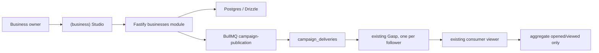

# Design Document: Business Broadcast MVP

## 1. Architecture decision

Business Broadcast is a business domain layered on the existing Gasp delivery
primitive. A campaign is not a new feed, viewer or client-side batch sender.
The backend fans it out into ordinary Gasp rows, preserving established expiry,
push, Socket.IO and cleanup behaviour.



## 2. Product boundaries

| Surface | Included | Excluded |
| --- | --- | --- |
| Business Studio | Overview, campaigns, workspace identity, aggregate metrics | Reactions, curation, creator tools, DMs |
| Consumer profile | Public verified business profile and follow/unfollow | Business ranking and categories |
| Campaign delivery | Existing Gasp hold/view, notification and expiry | Business reaction CTA and reaction-to-chat flow |
| Analytics | Queued, delivered, failed, opened, viewed | Per-person tracking, engagement score, exports |

Featured user reactions are a future product, not a hidden consequence of a
normal campaign reaction. It needs a distinct consent/rights workflow before
the business can publish user media.

## 3. Data model

Use `business_workspaces`, `business_members`, `business_followers`,
`business_campaigns`, `campaign_deliveries` and nullable `gasps.campaign_id`.

`campaign_reaction_selections` is not part of Business Broadcast. If it exists
from a previous experimental migration, it remains unused; removing historical
schema is a separate migration decision, not part of this MVP.

## 4. Backend contract

| Method | Route | Purpose |
| --- | --- | --- |
| GET | `/businesses/mine` | Membership guard for Studio |
| GET | `/businesses/:handle` | Consumer-safe public profile |
| POST / DELETE | `/businesses/:id/follow` | Explicit opt-in/out |
| GET | `/businesses/:id/overview` | Aggregate broadcast result |
| GET / POST | `/businesses/:id/campaigns` | List/create draft |
| GET / PATCH | `/businesses/:id/campaigns/:campaignId` | Detail, edit draft, close |
| POST | `/businesses/:id/campaigns/:campaignId/publish` | Snapshot and enqueue fan-out |

All Studio methods resolve active owner membership and allow-list status at the
service layer. The publish service checks daily limit, takes the eligible
audience snapshot and creates delivery records before enqueueing one
deterministic `campaign:{campaignId}` job.

The worker processes bounded chunks, rechecks eligibility, creates a normal
Gasp with `campaignId`, links the delivery, emits the existing Gasp event and
uses business display data in the existing notification pipeline. It reconciles
terminal delivery counts into `live` or `failed`.

The existing Gasp/reaction surface must identify campaign Gasps and suppress
the business reaction capture path. This prevents a campaign from creating a
conversation with the business owner while retaining personal Gasp reactions.

## 5. Mobile design

```text
Personal Profile
  └── Business Studio entry (owner only)

(business)
  ├── Overview: active/latest campaign + aggregate broadcast metrics
  ├── Campaigns: list, draft composer, preview and publish confirmation
  └── Workspace: identity, role and exit to personal Profile

Consumer
  └── business/[handle]: verified profile + Follow/Following
      └── normal Gasp viewer: hold/view only for campaign delivery
```

All server state stays in React Query, with workspace/campaign scoped keys. The
existing `CustomTabBar` remains unchanged. No new native SDK, Firebase project,
Firebase client configuration, app.json or EAS configuration is required.

## 6. Infrastructure and rollout

Use the existing Firebase Admin Storage/push, Redis and Railway environment.
Required values:

```text
BUSINESS_STUDIO_ENABLED=false
BUSINESS_STUDIO_ALLOWED_WORKSPACE_IDS=
BUSINESS_STUDIO_FOLLOWER_CAP=20
BUSINESS_STUDIO_CAMPAIGNS_PER_DAY=1
BUSINESS_STUDIO_FANOUT_CHUNK_SIZE=20
```

Deploy additive migration, module and worker with the feature disabled; seed
the demo workspace/owner/followers; run device plus capped queue QA; then enable
only the allow-listed demo workspace. Rollback is setting the feature flag off.
