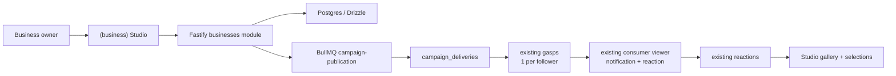
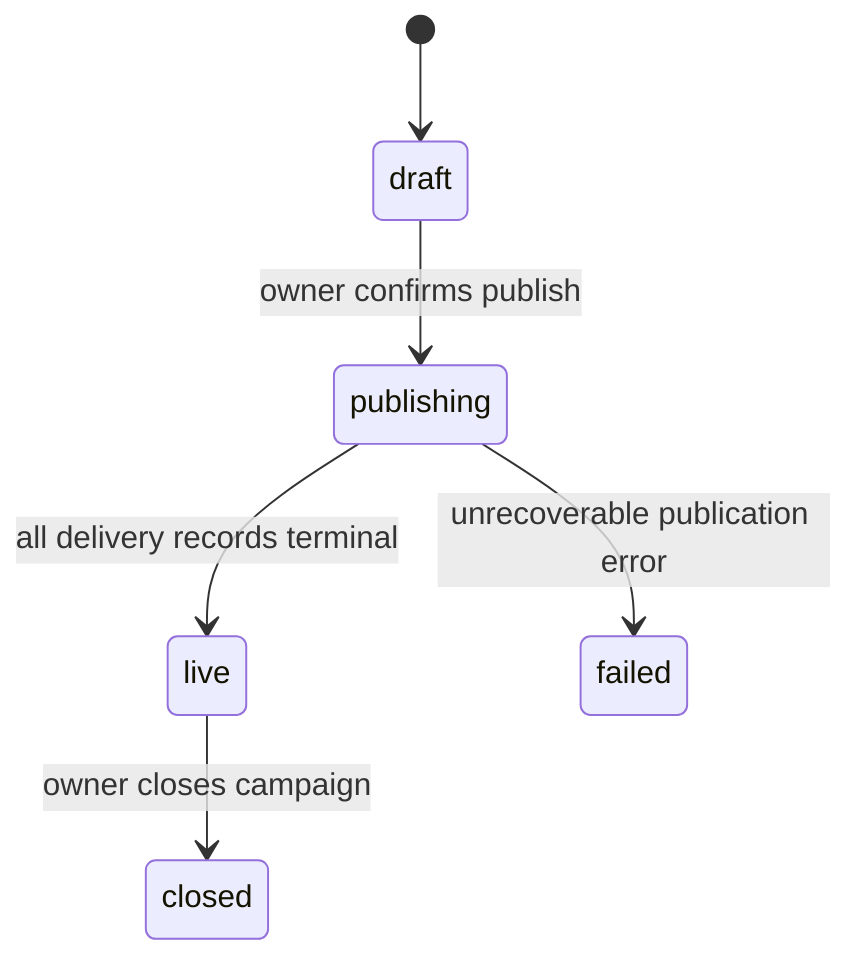

# Design Document: Business Studio MVP

## 1. Architecture decision

Business Studio is a new business domain layered on top of the existing Gasp
delivery primitive. A campaign does **not** introduce a second media viewer or
client-side batch sender. The backend fans it out into ordinary `gasps` rows.

This is the lowest-risk abstraction because the existing system already owns:

- Firebase-authenticated users and the mobile session;
- media capture and upload through `/uploads`;
- a Gasp's expiry, view, reaction, notification, Socket.IO and cleanup flow;
- PostgreSQL/Drizzle persistence and Redis/BullMQ background processing.



## 2. What changes, by layer

| Capability | Mobile front-end | Backend | Database | Firebase / external configuration |
| --- | --- | --- | --- | --- |
| Separate Studio | New `(business)` route group, tab bar, guard, Profile entry. | `GET /businesses/mine` membership check. | `business_workspaces`, `business_members`. | None. No native rebuild or new Firebase app. |
| Public business + follow | Business card/profile; Follow state. | Public profile, follow/unfollow service with blocks. | `business_followers`. | None. |
| Campaign draft | Reuse current capture/upload/text overlay; no friend picker. | Campaign CRUD + media ownership validation. | `business_campaigns`. | Reuse existing backend Firebase Storage upload. Add `campaigns` upload type/path. |
| Publish at scale | Confirmation/progress UI. | Snapshot, rate limits, dedicated BullMQ worker; use existing notification/socket functions. | `campaign_deliveries`; nullable `gasps.campaign_id`. | Reuse existing Redis and push config. No new provider. |
| Dashboard | Overview/list/detail with aggregate counters. | Aggregate queries by campaign. | Existing gasps/reactions joined through campaign id. | None. |
| Reaction gallery | Paginated grid/detail; selected state. | Safe reaction query and selection endpoints. | `campaign_reaction_selections`. | No new storage flow. |

### Material changes

- **Database:** yes — six additive changes/tables; described below. This is the
  most material implementation change.
- **Backend:** yes — one new Fastify module and one new BullMQ worker. Existing
  `gasps` creation must expose a small shared internal helper, not duplicate
  business logic.
- **Mobile:** yes — new JavaScript/TypeScript routes and components, but no new
  native SDK, permission, app.json, EAS, or Firebase client configuration.
- **Firebase:** no new project, Auth provider, iOS plist, Android JSON, FCM
  setup, or Storage bucket. The existing server Firebase Admin credential and
  bucket remain the integration point.
- **External configuration:** small Railway/environment change for feature flag
  and caps. Existing Redis must have capacity for one new queue.

## 3. MVP data model

```text
business_workspaces
  id PK, handle UNIQUE, display_name, avatar_url, bio
  verification_status, is_active, created_at, updated_at

business_members
  workspace_id FK, user_id FK, role
  UNIQUE(workspace_id, user_id)

business_followers
  workspace_id FK, user_id FK, created_at
  UNIQUE(workspace_id, user_id)

business_campaigns
  id PK, workspace_id FK, owner_user_id FK
  title, media_url, media_type, blurhash, text_overlay, replayable
  state, audience_snapshot_count, publish_error
  created_at, published_at, closed_at, updated_at

campaign_deliveries
  id PK, campaign_id FK, recipient_id FK, gasp_id FK NULL
  state, failure_code, delivered_at, created_at, updated_at
  UNIQUE(campaign_id, recipient_id)

campaign_reaction_selections
  campaign_id FK, reaction_id FK, selected_by_user_id FK, selected_at
  UNIQUE(campaign_id, reaction_id)

gasps (existing)
  + campaign_id NULL FK -> business_campaigns
  + index(campaign_id, recipient_id)
```

No compilation/reel/audit tables are needed in the MVP. `owner_user_id` and
`selected_by_user_id`, structured logs, and Sentry identify actions well enough
for one managed owner. An audit table is added only when multi-member operation
or compliance requires it.

### Database migration rules

1. Migrations are additive and versioned in `gasp-backend/src/db/migrations/`.
2. `gasps.campaign_id` is nullable, so all personal gasps retain current
   meaning and no data backfill is required.
3. Insert `campaign_deliveries` before a recipient is delivered. Its unique
   key is the fan-out idempotency boundary.
4. Add indexes for workspace campaign list, follower lookup, delivery
   aggregates, campaign reaction lookup, and selection filter.

## 4. Backend design

### New module

Create `src/modules/businesses/`:

```text
businesses.routes.ts        Fastify endpoints
businesses.schemas.ts       Zod input/query validation
businesses.service.ts       workspace, follow, campaign and analytics services
businesses.transformers.ts  public vs Studio-safe responses
businesses.service.test.ts  service/permission tests
campaign-publication.worker.ts  BullMQ fan-out worker
```

Register it under `/api/v1/businesses`. A role guard resolves workspace
membership from `business_members` and is run in every Studio service method.

### Minimal endpoint contract

| Method | Route | Purpose |
| --- | --- | --- |
| GET | `/businesses/mine` | active workspace membership for Studio guard |
| GET | `/businesses/:handle` | authenticated public profile + following state |
| POST / DELETE | `/businesses/:id/follow` | idempotent opt-in/out |
| GET | `/businesses/:id/overview` | aggregate metrics + active campaign |
| GET / POST | `/businesses/:id/campaigns` | list campaigns / create draft |
| GET / PATCH | `/businesses/:id/campaigns/:campaignId` | detail / edit draft or close |
| POST | `/businesses/:id/campaigns/:campaignId/publish` | snapshot + enqueue fan-out |
| GET | `/businesses/:id/campaigns/:campaignId/reactions` | cursor-paginated gallery |
| PUT / DELETE | `/businesses/:id/campaigns/:campaignId/reactions/:reactionId/selection` | idempotent selection |

There is no mobile create-workspace endpoint and no team, scheduling,
compilation, or analytics-export endpoint in MVP.

### Campaign lifecycle



Only services/worker transitions this state. The API returns authoritative state
and counts; the client never assumes that an accepted publish request delivered
every recipient.

### Fan-out worker

1. Publish service validates owner, feature flag, cap and `draft` state.
2. It snapshots eligible follower ids after block/active checks, stores count,
   creates `campaign_deliveries`, changes campaign to `publishing`, then enqueues
   `campaign:{campaignId}` on `campaign-publication`.
3. Worker takes bounded chunks, rechecks block/active eligibility, creates an
   ordinary Gasp with `campaignId`, links delivery, and calls existing
   `emitGaspReceived` and `notifyGaspReceived` using workspace identity.
4. Delivery and job keys prevent duplicate Gasps/pushes after retry.
5. Worker marks terminal aggregate result and campaign `live` or `failed`.

The existing consumer `POST /gasps/batch` remains unchanged and is not used by
Studio. Refactor the underlying Gasp insert into an internal shared function so
the two use cases share TTL and state defaults without calling an HTTP route.

### Safety and privacy

- Follow, publish, and query operations call a dedicated business-aware block
  helper. Do not force a Business_Workspace into `friendships` or `users`.
- Studio reaction response is a distinct safe schema. It returns only product-
  approved display data and never phone/presence/friendship fields.
- Analytics are aggregate-only. The backend must not add an endpoint listing
  people who opened or ignored a campaign.
- Deactivating a workspace blocks publish and removes its public profile.

## 5. Firebase and infrastructure impact

### Firebase

The current app already uses Firebase Auth and the backend's Firebase Admin
SDK for Storage/push. **No new Firebase Console configuration is needed** for
the MVP:

- no new Firebase project, bucket, Auth provider, FCM credential, iOS plist,
  Android `google-services.json`, Expo plugin, or runtime permission;
- mobile keeps uploading through the existing authenticated `/uploads` API;
- backend adds `campaigns` to its upload media-type allow-list and writes to a
  workspace-scoped path such as `campaigns/{workspaceId}/...` only after owner
  membership validation;
- existing Admin service-account permissions must already permit Storage writes
  to the configured bucket.

**Existing risk, not a Business-specific configuration change:** the current
upload service calls `makePublic()` and returns public bucket URLs. That is an
existing security backlog item. It is acceptable only for a tightly controlled
pilot if product accepts the risk; signed URLs/storage access hardening must
precede a broader release or any private brand material.

### Railway / Redis / environment

Add validated backend environment values:

```text
BUSINESS_STUDIO_ENABLED=false
BUSINESS_STUDIO_ALLOWED_WORKSPACE_IDS=
BUSINESS_STUDIO_FOLLOWER_CAP=50
BUSINESS_STUDIO_CAMPAIGNS_PER_DAY=1
BUSINESS_STUDIO_FANOUT_CHUNK_SIZE=25
```

Use the existing `DATABASE_URL`, `REDIS_URL`, `SENTRY_DSN`, Firebase service
account values, and notification pipeline. Add one BullMQ queue and worker to
the existing process/startup lifecycle. No third-party service is introduced.

## 6. Mobile design

```text
Personal Profile
  └── Business Studio entry (only when membership exists)

(business) route group
  ├── Overview: workspace identity, active campaign, aggregate metrics
  ├── Campaigns: list + create draft
  │   └── Campaign detail: media, progress/funnel, reaction CTA
  ├── Reactions: campaign-selected gallery
  │   └── Reaction detail: existing composite player + selection action
  └── Workspace: identity/role/exit only

Public business route
  └── business/[handle]: identity, follow action, featured campaign
```

- `Profile` merely provides an entry; it does not gain campaign controls.
- `BusinessStudioTabBar` is a new component; existing `CustomTabBar` stays
  untouched.
- `BusinessCampaignComposer` reuses capture/gallery selection and media upload
  utilities, then calls create-draft API. It omits friend selection completely.
- Query keys include `workspaceId` and `campaignId`; publish progress uses
  bounded polling while state is `publishing`.
- `CampaignReactionGrid` is virtualised and cursor-paginated. Existing
  `ReactionPlaybackModal`/composite presentation is reused for playback.

## 7. Rollout and rollback

1. Deploy additive migrations, backend module and worker with feature flag off.
2. Seed one verified workspace plus owner and controlled followers.
3. Enable flag and allowed workspace only in staging/internal production pilot.
4. QA publish/reaction flows on physical devices and run capped queue test.
5. Disable `BUSINESS_STUDIO_ENABLED` to halt entry/publishing immediately if
   needed. Existing delivered Gasps retain their normal lifecycle.

## 8. Future phases

After the pilot, add in this order: team editor/viewer management, scheduling,
multiple-workspace switcher, business search/ranking, richer analytics, then
rights-approved compilation/reel rendering/export. Each phase must receive its
own requirements/design/tasks slice; it must not silently expand this MVP.
