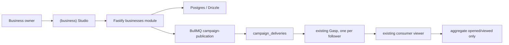

# Design Document: Business Broadcast MVP

> **Repositório do backend:** Todas as criações e alterações de backend devem ser feitas no repositório localizado em `C:\Users\erick.ERIKHENRIQUE\Downloads\Projetos\GASP\gasp-backend-main`.

## 1. Architecture decision

Business Broadcast is a business domain layered on the existing Gasp delivery
primitive. A campaign is not a new feed, viewer or client-side batch sender.
The backend fans it out into ordinary Gasp rows, preserving established expiry,
push, Socket.IO and cleanup behaviour.



## 2. Product boundaries

| Surface | Included | Excluded |
| --- | --- | --- |
| Business Studio | Overview, campaigns, workspace identity, aggregate metrics | Reactions, curation, creator tools, DMs |
| Consumer profile | Public verified business profile and follow/unfollow | Business ranking and categories |
| Campaign delivery | Existing Gasp hold/view, notification and expiry | Business reaction CTA and reaction-to-chat flow |
| Analytics | Queued, delivered, failed, opened, viewed | Per-person tracking, engagement score, exports |

Featured user reactions are a future product, not a hidden consequence of a
normal campaign reaction. It needs a distinct consent/rights workflow before
the business can publish user media.

## 3. Data model

Use `business_workspaces`, `business_members`, `business_followers`,
`business_campaigns`, `campaign_deliveries` and nullable `gasps.campaign_id`.

Every row in `business_followers` carries three flags that are set at insert time
and never derived on the fly:

| Flag | Default | Meaning |
| --- | --- | --- |
| `explicit` | `false` | The user has not yet taken a follow/unfollow action |
| `idempotent` | `true` | Repeated follow/unfollow actions are safe to replay |
| `independent` | `true` | The relationship is separate from friendships and conversations |

These defaults apply to all user–workspace relationship rows, including rows
created before any explicit follow action has occurred (R2.5).

`campaign_reaction_selections` is not part of Business Broadcast. If it exists
from a previous experimental migration, it remains unused; removing historical
schema is a separate migration decision, not part of this MVP.

## 4. Backend contract

| Method | Route | Purpose |
| --- | --- | --- |
| GET | `/businesses/mine` | Membership guard for Studio |
| GET | `/businesses/:handle` | Consumer-safe public profile |
| POST / DELETE | `/businesses/:id/follow` | Explicit opt-in/out |
| GET | `/businesses/:id/overview` | Aggregate broadcast result |
| GET / POST | `/businesses/:id/campaigns` | List/create draft |
| GET / PATCH | `/businesses/:id/campaigns/:campaignId` | Detail, edit draft, close |
| POST | `/businesses/:id/campaigns/:campaignId/publish` | Snapshot and enqueue fan-out |

All Studio methods resolve active owner membership and allow-list status at the
service layer. The publish service checks daily limit, takes the eligible
audience snapshot and creates delivery records before enqueueing one
deterministic `campaign:{campaignId}` job.

**Block enforcement (R2.6):** When a consumer block is active, the service layer
must atomically override all three of discovery, follow state and delivery in a
single transaction. Partial states — for example suppressing delivery while
leaving the follow record intact — are not permitted.

The worker processes bounded chunks, rechecks eligibility, creates a normal
Gasp with `campaignId`, links the delivery, emits the existing Gasp event and
uses business display data in the existing notification pipeline. It reconciles
terminal delivery counts into `live` or `failed`.

The `/gasps/batch` endpoint restriction applies only to campaign publication
fan-out: the mobile client must never call `/gasps/batch` as part of sending a
campaign to followers. Unrelated client use of `/gasps/batch` for personal Gasp
flows is not restricted (R4.1).

The existing Gasp/reaction surface must identify campaign Gasps and suppress
the business reaction capture path. This prevents a campaign from creating a
conversation with the business owner while retaining personal Gasp reactions.

**Recipients who also own a business (R4.7):** If a campaign Gasp recipient
holds an active owner membership in another (or the same) workspace, they
access Studio through the normal owner entry point. Campaign Gasps sitting in
their consumer inbox do not gate or restrict Studio access in any way. No
special handling is required; this is the correct behaviour by design.

## 5. Mobile design

```text
Personal Profile
  └── Business Studio entry (owner only)

(business)
  ├── Overview: active/latest campaign + aggregate broadcast metrics
  ├── Campaigns: list, draft composer, preview and publish confirmation
  ├── Workspace: identity, role and exit to personal Profile
  └── Metrics: per-campaign delivery breakdown + workspace aggregate totals

Consumer
  └── business/[handle]: verified profile + Follow/Following
      └── normal Gasp viewer: hold/view only for campaign delivery
```

**Business tab bar (R1.3):** For `accountType === 'business'` users the Chat tab
slot in the bottom tab bar is replaced by a Metrics shortcut (BarChart2 icon,
label "Métricas"). The underlying `chat` route remains registered in the Expo
Router layout so no navigation contract is broken; the substitution is applied
entirely in `CustomTabBar` by reading `user.accountType` from the auth store.
Pressing the Metrics tab navigates to `/(business)/metrics` via `router.push`.
Personal accounts are unaffected — they continue to see the Chat tab.

**Studio session and personal data (R1.6):** There is no cache isolation
mechanism during an active Studio session. Personal caches, chats and pending
Gasps are accessible as normal while the owner is using Studio. Protection of
personal data — ensuring Studio operations do not pollute personal caches —
applies only at the moment the owner exits Studio.

**Campaign publish confirmation (R3.3):** The confirmation dialog is shown as
soon as the owner initiates publication. The eligible-follower count is
displayed as informational context inside that dialog but is not required to
have loaded before the dialog appears; the UI must not block showing the dialog
while waiting for a follower-count fetch.

**Publish submission state (R3.6):** After the owner confirms and the request is
submitted, the client transitions to a loading/publishing state and stays there
until the backend confirms `live` status. No success toast, checkmark or
positive acknowledgement is shown on acceptance. The accepted state must never
be represented as an immediate success; only a backend-confirmed `live` result
may be surfaced as success.

**React Query cache keys (R5.3):** All Studio queries must be scoped to both
`workspaceId` and `campaignId`. Any query where either identifier is absent must
fail immediately rather than proceed with reduced or partial data. This prevents
cache leakage between workspaces.

All other server state stays in React Query with workspace/campaign scoped keys.
The existing `CustomTabBar` remains unchanged. No new native SDK, Firebase
project, Firebase client configuration, app.json or EAS configuration is
required.

## 6. Infrastructure and rollout

Use the existing Firebase Admin Storage/push, Redis and Railway environment.
Required values:

```text
BUSINESS_STUDIO_ENABLED=false
BUSINESS_STUDIO_ALLOWED_WORKSPACE_IDS=
BUSINESS_STUDIO_FOLLOWER_CAP=20
BUSINESS_STUDIO_CAMPAIGNS_PER_DAY=1
BUSINESS_STUDIO_FANOUT_CHUNK_SIZE=20
```

`BUSINESS_STUDIO_FOLLOWER_CAP=0` is a valid configuration (R6.2). It prevents
campaign delivery — the fan-out worker will snapshot an empty eligible audience
— while the feature otherwise remains enabled and Studio entry is unaffected.

**Feature flag behaviour (R6.3):** When `BUSINESS_STUDIO_ENABLED` is `false`,
the publish endpoint denies all publishing operations. Studio entry for owners
who are present in `BUSINESS_STUDIO_ALLOWED_WORKSPACE_IDS` MAY still be
permitted at implementation discretion; the flag does not mandate that Studio be
fully hidden from allow-listed owners. Setting the flag to `false` is the
immediate rollback mechanism for publishing, not necessarily for Studio
visibility.

Deploy additive migration, module and worker with the feature disabled; seed
the demo workspace/owner/followers; run device plus capped queue QA; then enable
only the allow-listed demo workspace.
