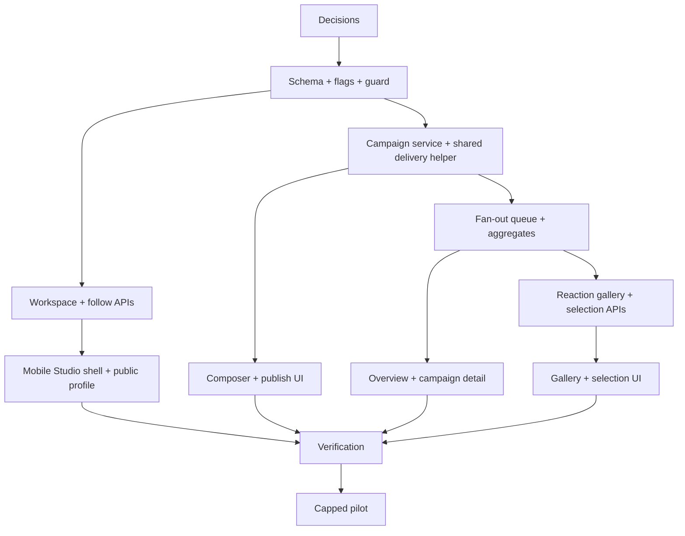

# Implementation Plan: Business Studio MVP

## Scope guard

Implement only the managed-pilot capabilities in `requirements.md`. Do not add
team management UI, scheduling, reel rendering/export, business DMs, public
ranking, billing, or rich analytics under this spec.

## 0. Product and operational decisions

- [ ] 0.1 Confirm pilot workspace, owner account, real/demo brand status,
  follower cap, campaign-frequency cap, and whether reaction identity is
  visible to the owner.
  - _Requirements: R2, R3, R8_
- [ ] 0.2 Confirm current 24-hour Gasp expiry/replay settings apply to campaigns.
  - _Requirements: R4, R5_
- [ ] 0.3 Confirm written acceptance of the current public Firebase Storage URL
  risk for a controlled pilot, or make signed URL hardening a prerequisite.
  - _Requirements: R8_

## 1. Backend foundation and migration

- [ ] 1.1 Add validated Business Studio configuration in `src/config/env.ts`
  - Feature flag, workspace allow-list, follower cap, campaigns/day, and
    fan-out chunk size; safe defaults keep the feature disabled.
  - _Requirements: R8_
- [ ] 1.2 Add Drizzle schema and versioned migrations
  - `business_workspaces`, `business_members`, `business_followers`,
    `business_campaigns`, `campaign_deliveries`,
    `campaign_reaction_selections`, and nullable `gasps.campaign_id`.
  - Add unique and aggregate-query indexes from design.
  - _Requirements: R2, R3, R4, R5, R7, R8_
- [ ] 1.3 Add a controlled pilot seed/admin procedure
  - Provision one verified workspace and owner; document rollback/deactivation.
  - No public or mobile workspace-creation endpoint.
  - _Requirements: R2, R8_
- [ ] 1.4 Add a business membership/role guard and safe transformers
  - Enforce active allowed workspace/owner at service layer.
  - Define separate public business and Studio reaction response schemas.
  - _Requirements: R1, R2, R6, R8_

## 2. Workspace and audience APIs

- [ ] 2.1 Implement `GET /businesses/mine` and public profile by handle.
  - _Requirements: R1, R2, R3_
- [ ] 2.2 Implement idempotent follow/unfollow.
  - Apply active, cap and business-aware block checks without creating a
    friendship or conversation.
  - _Requirements: R3, R8_
- [ ] 2.3 Add a small seeded Business result/card contract to Discover.
  - Do not alter personal `User`/`RecommendedUser` schemas; use a discriminator.
  - _Requirements: R3_

## 3. Campaign and delivery backend

- [ ] 3.1 Add `campaigns` to the authenticated backend upload allow-list.
  - Store only under `campaigns/{workspaceId}/...` after owner validation.
  - Reuse existing Firebase Admin Storage credentials and `/uploads` flow.
  - _Requirements: R4, R8_
- [ ] 3.2 Implement campaign draft CRUD and state-transition service.
  - Draft create/edit, publish confirmation endpoint, close and authoritative
    `draft → publishing → live|failed → closed` transitions.
  - _Requirements: R4_
- [ ] 3.3 Extract a shared internal Gasp delivery helper.
  - Keep current TTL/status defaults and re-use it from personal Gasp and
    campaign delivery services; do not call an internal HTTP endpoint.
  - _Requirements: R5, R8_
- [ ] 3.4 Add `campaign-publication` BullMQ queue and worker.
  - Snapshot eligible followers, create idempotent deliveries, process bounded
    chunks, link each generated Gasp, use existing socket/push services, and
    reconcile campaign outcome/progress.
  - _Requirements: R5, R8_
- [ ] 3.5 Implement overview, campaign-detail and aggregate analytics queries.
  - Returned counts: queued/delivered/failed/opened/reacted/selected only.
  - _Requirements: R5, R6_

## 4. Reaction gallery and selection backend

- [ ] 4.1 Implement cursor-paginated campaign reaction query.
  - Newest/Selected filters, privacy-safe actor fields, block/moderation/expiry
    behaviour, and owner guard.
  - _Requirements: R6, R8_
- [ ] 4.2 Implement idempotent selection/unselection endpoints.
  - Verify the reaction belongs to the stated campaign; persist owner/timestamp.
  - _Requirements: R7_

## 5. Mobile contracts and separate Studio shell

- [ ] 5.1 Add business Zod schemas, API service, query keys and cache invalidation.
  - Keys must include workspace/campaign ids.
  - _Requirements: R1, R3-R7_
- [ ] 5.2 Add Profile entry, public business profile and follow UI.
  - Profile entry only for members; public profile only exposes consumer-safe data.
  - _Requirements: R1, R3_
- [ ] 5.3 Create `(business)` layout and `BusinessStudioTabBar`.
  - Route guard, safe unavailable state, Overview/Campaigns/Reactions/Workspace,
    and explicit exit to personal Profile.
  - _Requirements: R1_

## 6. Mobile campaign and curation flows

- [ ] 6.1 Build Overview, campaign list and campaign detail.
  - Include all loading/empty/failed/publishing states and bounded progress poll.
  - _Requirements: R4-R6_
- [ ] 6.2 Build BusinessCampaignComposer and publish confirmation.
  - Reuse media capture/upload/text overlay; do not render friend recipient UI.
  - _Requirements: R4, R5_
- [ ] 6.3 Build virtualised CampaignReactionGrid and reaction detail.
  - Reuse existing playback/composite UI where compatible.
  - _Requirements: R6_
- [ ] 6.4 Add selection mutation, selected count and filter.
  - Optimistic UI must roll back on API failure.
  - _Requirements: R7_

## 7. Verification and controlled rollout

- [ ] 7.1 Backend tests
  - Membership, follow/block, state transitions, migration constraints, fan-out
    idempotency, retry/dedupe, aggregate privacy and selection rules.
  - _Requirements: R2-R8_
- [ ] 7.2 Mobile tests and full consumer regression suite.
  - Route guard, separate navigation, composer validation, cache isolation,
    gallery selection rollback, and current Gasp/reaction/notification flows.
  - _Requirements: R1, R4-R8_
- [ ] 7.3 Execute physical-device owner + two-follower QA.
  - Follow, publish, background push, view, reaction, gallery, selection,
    unfollow-before-publish, block and Studio exit.
  - _Requirements: R3-R8_
- [ ] 7.4 Execute queue test at approved follower cap and document evidence.
  - Validate throughput, terminal counts, retries and zero duplicates.
  - _Requirements: R5, R8_
- [ ] 7.5 Enable the allowed workspace pilot; record flag/cap/rollback owner.
  - _Requirements: R8_

## Dependency graph

## Definition of done

One administrator-provisioned owner can enter a separate Studio, create and
publish a campaign to an explicit capped audience, while personal followers
receive and react through unchanged GASP screens. The owner can see aggregate
results, browse campaign reactions safely, and persist selections. All
permissions, blocks, migration, idempotency, device and capped-queue checks
pass with the feature flag available as immediate rollback.
