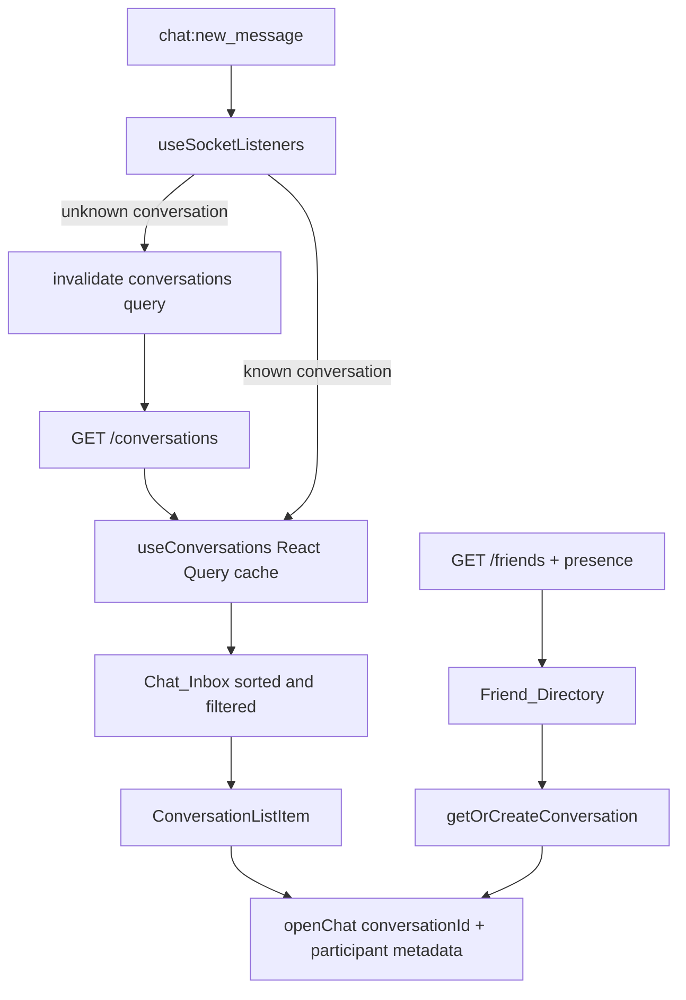

# Design Document: Chat Inbox MVP

## Overview

Chat Inbox MVP changes the Chat tab from a friend directory into a compact
conversation inbox. The implementation reuses existing frontend contracts:

- `useConversations()` already fetches normalized conversation rows with last
  message data and unread counts.
- `useFriends()` and `useOnlineStatus()` already power the friend directory and
  online presence.
- `openChat()` already supplies typed navigation for a conversation.
- `useSocketListeners()` already updates existing conversation cache entries
  when messages arrive.

The only realtime gap is a message for a conversation not currently in the
cache. Rather than inventing a client-side conversation record, the listener
will invalidate `queryKeys.conversations.all`; the existing query refetches the
server-authoritative participant metadata and row.

## Product Direction

The MVP has three jobs, in this order:

1. Make unread and recent conversations easy to recognize.
2. Preserve a fast route to every friend for a first conversation.
3. Preserve the camera-first **Send Gasp to All** action.

It deliberately does not add a notification bell or a second activity feed.
The inbox itself becomes the durable destination for message awareness.

```text
┌─────────────────────────────────────┐
│ CHAT                            [◉] │
│ [ Chats ]  [ Friends ]              │
│ [ Search chats or friends...      ] │
│                                     │
│ Conversations                       │
│ (avatar)  Marina              2 min │
│           Sent you a Gasp        1  │
│                                     │
│ (avatar)  Lucas               Yesterday│
│           See you later!             │
│                                     │
│        [ SEND GASP TO ALL ]          │
└─────────────────────────────────────┘
```

## UI Structure

### Screen composition

`app/(tabs)/chat.tsx` becomes a lightweight screen coordinator:

1. Header (`InboxHeader` may be renamed/generalized only if that reduces
   ambiguity).
2. Two-option segmented control: **Chats** and **Friends**.
3. Existing `SearchBar`, with selected-view-specific placeholder.
4. Exactly one virtualized list:
   - Chats: `ConversationListItem` data from `useConversations()`.
   - Friends: existing `FriendListItem` data from `useFilteredFriends()`.
5. Existing absolute `SendGaspToAllButton`.

The current `StatsRow` is removed from this screen. It consumes high-value
vertical space without helping a user select a conversation.

### Chat Inbox row

Create `components/chat/ConversationListItem.tsx`. It is separate from
`FriendListItem` because a conversation owns server-derived preview, timestamp,
and unread state while a friend without a conversation does not.

| Element | Source | Behavior |
|---|---|---|
| Avatar | Other participant avatar | Use shared avatar/initial fallback. |
| Presence dot | Friend presence, if resolvable | Optional and visually secondary. |
| Name | Other participant in `Conversation` | One line; bold if unread. |
| Time | `lastMessageAt ?? updatedAt` | Relative format; one short line. |
| Preview | `lastMessage` | One line; type-safe localized fallback. |
| Unread badge | `unreadCount` | Visible only for counts greater than zero. |

Preview mapping:

| Last message type | Preview |
|---|---|
| `text` | Truncated `content` |
| `gasp` | `chat.inbox.sentGasp` |
| `reaction` | `chat.inbox.reactedToGasp` |
| `image` | `chat.inbox.sentPhoto` |
| no last message | `chat.inbox.startConversation` |

No ephemeral-media thumbnail is included. This keeps the inbox privacy-safe
and avoids loading media just to render a list.

### Selection and search UI state

The screen owns exactly two local React state values:

```ts
selectedView: 'chats' | 'friends'
searchQuery: string
```

The same local `searchQuery` filters the currently selected, derived list with
`useMemo`. This feature does not read or write `inboxStore.searchQuery` and
does not introduce a second search state. `inboxStore` remains the UI-only
source for hydrated friend presence data; React Query remains the source for
conversations and friends.

On selection change:

- Clear the local query, because it has changed search domain.
- Change the placeholder to `Search chats...` or `Search friends...`.
- Do not mix friends into the conversation list.

### Empty and loading states

Chats has its own empty state: icon, localized `No chats yet` title, short
explanation, and a button that selects Friends. It does not invite the user to
send a message without identifying a recipient.

Friends retains a familiar empty/no-results state. Lists use `QueryState` or
the existing skeleton convention so loading cannot be mistaken for an empty
inbox.

## Data Flow



### Conversation participant resolver

Use existing participant identity conventions from `chatParticipant.ts` as the
reference. The row resolves the participant whose id differs from the signed-in
user's id. For resilience:

1. Prefer the matching participant name/avatar in the conversation.
2. Use a localized fallback name only if the server record is incomplete.
3. Pass resolved name/avatar to `openChat()` so navigation has immediate
   context even before a later cache refresh.

This work does not change `ConversationSchema` or API responses.

### Realtime cache change

In the existing `onChatNewMessage` callback:

1. Determine whether `queryKeys.conversations.all` contains the event's
   `conversationId`.
2. Preserve the current update behavior for known conversations.
3. If absent, call `queryClient.invalidateQueries` for the conversations query.
4. Do not add server data to Zustand and do not fabricate a partial
   `Conversation`; only the refetched endpoint supplies the normalized model.

The existing global `CustomTabBar` already consumes `useConversations()`, so
the cache is normally active even before the user visits Chat.

## File-Level Implementation Plan

| File | Change |
|---|---|
| `app/(tabs)/chat.tsx` | Coordinate view selection, selected data source, search, empty states, and list headers. |
| `components/chat/ConversationListItem.tsx` | New accessible row for recent conversations. |
| `components/chat/ConversationListSkeleton.tsx` | Extend if necessary for the conversation-row visual shape. |
| `components/chat/conversationPreview.ts` | Required pure helper for preview text, time and participant derivation. |
| `hooks/useSocketListeners.ts` | Invalidate conversation query when a new message is for an uncached conversation. |
| `locales/en.json` and applicable locale files | Add all new copy. |
| Tests under `components/chat/__tests__` and `hooks/__tests__` | Cover row states and cache-refresh behavior. |

No backend file changes are required.

## Accessibility and visual rules

- Each tab control exposes role `tab` and `accessibilityState.selected`.
- Each row has role `button` and an explicit label, for example:
  `Marina, sent you a Gasp, 1 unread message`.
- The unread distinction combines text weight and a numeric badge; it is never
  color-only.
- Avatar fallbacks use initials; image loading failure must not make a row
  untappable.
- Rows use one-line truncation for identity, preview, and timestamp to remain
  stable with long localized strings.

## Out of Scope and Tradeoffs

This design does not persist notification events. A user returning to the app
can always find message activity through Conversation_Source, but an expired
toast for an unrelated friend event is not kept as a history item. That is a
separate, backend-backed Activity Center feature and should be evaluated after
this MVP is validated.

Likewise, pinning, mute controls, group conversations, a horizontal online
carousel, and previews of Gasp media are intentionally deferred. They create
more UI and state than is necessary to solve message discoverability now.

## Validation Matrix

| Scenario | Expected result |
|---|---|
| Existing unread text message | Sender is first by activity, bold, previewed, and has unread badge. |
| Existing received Gasp | Sender is visible with safe Gasp preview text, no media reveal. |
| First message from a friend | Query refetch adds the sender's conversation row. |
| Open a conversation | Correct chat opens; only its unread count clears. |
| No conversations | Clear empty state routes to Friends. |
| Friends search | Search and get-or-create behavior continue to work. |
| Screen reader | Tabs and row content announce correctly. |
