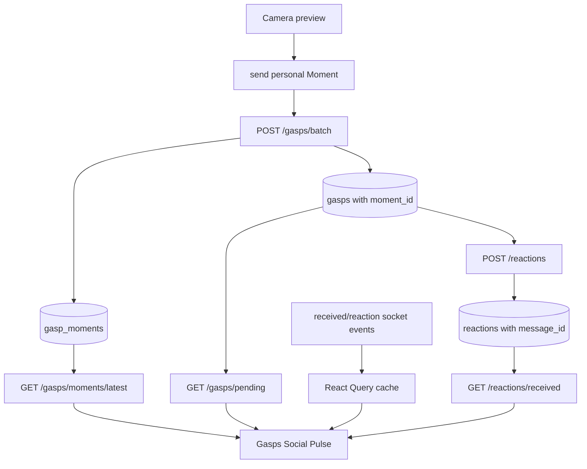

# Design Document: Gasps Social Pulse

## Overview

Gasps Social Pulse reworks `app/(tabs)/inbox.tsx` from a stacked event list
into a private social home. The product order is intentional:

1. Open the personal Gasp that needs attention now.
2. See the outcome of the most recent Moment you sent.
3. See reactions that came back to you.
4. Handle secondary social activity.

The MVP does not redesign capture, the hold-to-view lifecycle, reaction
recording, Business Studio, or public discovery. It makes the existing loop
legible and adds the smallest durable data model required for that legibility.

### Product decision

```text
Gasps is a private pulse among friends, not a public content feed.
```

This means:

- no follower or creator mechanics;
- no public ranking or autoplaying media;
- no mandatory daily prompt;
- Business Studio remains in `app/(business)` and its campaign data is not a
  source for this screen;
- clear media stays inside deliberate viewer/reaction routes.

### Current-state gaps

| Current behavior | Consequence | MVP decision |
| --- | --- | --- |
| Friend requests, Gasps, reactions, and sent items share a vertical list. | Urgent and low-urgency events compete. | Put Incoming_Gasps first; lower activity becomes secondary. |
| Each batch send is stored as independent recipient Gasp rows. | The sender cannot see one social outcome. | Add a parent Moment. |
| Reactions in the tab come from local Zustand state. | The result can disappear after session reset. | Add a received-reactions API plus React Query hook. |
| Header/card instructions mix tap and hold language. | The opening affordance is ambiguous. | Tap opens; hold is described only inside the viewer. |
| Current blur protects media. | Privacy is a core asset. | Preserve it in every list/rail/card state. |

## Architecture

### Information architecture and data flow



### Screen composition

```text
┌─────────────────────────────────────┐
│ GASPS                          [CAM]│
│ 3 moments waiting to be opened      │
│                                     │
│ OPEN NOW                            │
│ [Ana  12m] [Leo  1h] [Mia  3h]     │
│                                     │
│ YOUR LATEST MOMENT                  │
│ [private blurred card]              │
│ Sent to 4 friends · 3 opened · 1 ↳  │
│                                     │
│ REACTIONS FOR YOU                   │
│ [Alex reacted] [Marina reacted]     │
│                                     │
│ ACTIVITY                            │
│ friend request / delivery detail    │
└─────────────────────────────────────┘
```

#### Header

- Title: `Gasps`, not `Feed` or `Inbox`.
- Supporting line changes by state: `3 moments waiting`, `Nothing waiting`,
  or an equally short localized equivalent.
- The camera action opens the existing capture route. It must remain reachable
  even in an empty state.
- No global count badge competes with the Open-now items themselves.

#### Open now

`OpenNowRail` is a horizontal, privacy-safe rail. Each `OpenNowItem` uses:

| Element | Behavior |
| --- | --- |
| Avatar/name | Identity and one-line fallback. |
| Countdown ring | Reuse expiry semantics; urgent state is communicated by icon/text as well as color. |
| Preview | Blurhash/blurred media or intentional video placeholder only. |
| Action | Tap opens the existing viewer; loading is item-scoped. |

The rail may show several compact portrait tiles. It must not autoplay video,
download original media solely for display, or reveal `textOverlay` before the
viewer. When there is exactly one Incoming_Gasp, the item may use a larger
spotlight footprint while retaining the same data and privacy rules.

#### Your latest moment

`LatestMomentCard` is a single, compact status card. It has a visual treatment
derived from the already-owned media but remains blurred. Its semantic content
is the outcome, not the file:

```text
Sent to 4 friends
3 opened · 1 reaction · expires in 18h
```

Tap opens a detail bottom sheet or a lightweight Moment detail route only when
there is useful recipient status to inspect. The initial MVP can make the card
non-navigable until that detail surface has an approved product purpose; it
must not create a dead button.

#### Reactions for you

`ReactionReturnItem` shows reactor identity, relative time, and a compact
reaction/composite affordance. It does not autoplay, expose another user's raw
reaction on the list, or use a generic notification row. A tap follows the
existing reaction continuation contract with conversation and message context.

The visual priority is below Open now because a reaction has no 24-hour action
deadline, but above generic activity because it is direct social return.

#### Activity and empty states

Existing friend-request affordances remain available but move below the core
three sections. If nothing is available, show a camera-first empty state with:

- a short private/social value proposition;
- a primary `Capture a Gasp` action;
- a secondary link to find friends only when the user has no friends.

### Realtime behavior

| Event | Query cache behavior |
| --- | --- |
| `gasp:received` | Add/update pending list; invalidate attention summary if used. |
| Gasp opened/viewed/expired | Update/remove pending list; refresh Latest_Moment only for the sender. |
| `gasp:reaction_received` | Add/invalidate `reactions.received` and `gasps.latestMoment` for the sender; preserve current chat event behavior. |
| Reconnect | Existing query refetch restores server authority; no synthetic Moment/Reaction records in Zustand. |

### Frontend file layout

```text
services/api/schemas/gasp.schema.ts       Moment and LatestMoment schemas
services/api/schemas/reaction.schema.ts   ReactionReturn schema
services/api/gasps.ts                     getLatestMoment
services/api/reactions.ts                 getReceivedReactions
hooks/queries/useGasps.ts                 useLatestMoment
hooks/queries/useReactions.ts             useReceivedReactions
services/queryKeys.ts                     gasps.latestMoment, reactions.received
```

The exact file split may follow the existing schema organization, but all
server types must remain Zod-derived and responses must pass
`validateResponse`.

## Components and Interfaces

### Screen/component split

| File | Responsibility |
| --- | --- |
| `app/(tabs)/inbox.tsx` | Thin screen coordinator and section ordering. |
| `components/inbox/GaspsPulseHeader.tsx` | Title, attention copy, camera entry. |
| `components/inbox/OpenNowRail.tsx` | Horizontal rail and empty/loading states. |
| `components/inbox/OpenNowItem.tsx` | One accessible privacy-safe incoming item. |
| `components/inbox/LatestMomentCard.tsx` | Latest sent Moment summary. |
| `components/inbox/ReactionReturnSection.tsx` | Server-backed received-reaction section. |
| `components/inbox/ReactionReturnItem.tsx` | One durable social-return affordance. |
| Existing request/activity components | Secondary section only; preserve accept/reject behavior. |

`useGaspStore.reactions` may continue supporting an immediate local reaction
experience elsewhere, but it is removed as the source of the tab's durable
section. Socket arrivals update the React Query caches through the existing
global listener pattern.

### Query hooks and contracts

| Hook | Source | Enabled condition |
| --- | --- | --- |
| `useLatestMoment` | `GET /api/v1/gasps/moments/latest` | User authenticated |
| `useReceivedReactions` | `GET /api/v1/reactions/received?cursor=` | User authenticated |
| Existing `useGasps` / pending query | `GET /api/v1/gasps/pending` | User authenticated |

All hooks expose `data`, `isLoading`, `isEmpty`, `isError`, and `refetch`
semantics. No server loading state is stored in Zustand.

### Zod schemas

All field names follow the project's camelCase convention, matching the
existing `GaspSchema` and `ApiGaspSchema` patterns. Snake_case is used only
in the database column names (Data Models section).

```text
MomentSchema          id, senderId, imageUrl, mediaType, blurhash (string, non-null),
                      textOverlay (optional), replayable, createdAt, expiresAt

LatestMomentSchema    id, recipientCount, deliveredCount, openedCount,
                      reactionCount, isExpired, expiresAt,
                      identitySummaries (max 3), mediaMetadata

ReactionReturnSchema  id, gaspId, reactor (identity summary with displayName),
                      reactionMediaUrl, originalMediaMetadata,
                      capturedAt, conversationId (nullable), messageId (nullable)

OriginalMediaMetadataSchema
                      imageUrl, mediaType
```

`blurhash` is typed as `z.string()` (non-nullable) in both `MomentSchema` and
the existing `GaspSchema`, consistent with `normalizePendingGasp` coercing
`null` to `''` at the API boundary. All domain types are derived from these
schemas via `z.infer<>`. No manual type aliases that duplicate schema shape are
created.

### Navigation contracts

| Component | Action | Typed route |
| --- | --- | --- |
| `OpenNowItem` | Tap | `openGaspViewer({ imageUri, senderName, mediaType, blurhash, gaspId })` — all five params required; guard returns early if `imageUri` is absent |
| `ReactionReturnItem` | Tap | New `openReactionContinuation` helper with reaction, chat, and result-media context — see note below |
| `LatestMomentCard` | Tap (deferred MVP) | Not navigable until a detail destination is approved |
| `GaspsPulseHeader` | Camera tap | Existing capture route |

`openGaspViewer` (in `services/navigation.ts`) requires at minimum `imageUri`
and `senderName`; without `imageUri` it returns immediately without navigating.
`OpenNowItem` must resolve both from the `Gasp` object before calling the
helper — the `Gasp.imageUri` field holds the local cached URI, and
`Gasp.senderName` is the display name. Do not call `openGaspViewer` with only
`gaspId`.

**`openReactionContinuation` (new helper in `services/navigation.ts`)**: No
typed helper exists today for the `gasp.reaction_received` continuation.
Task 4.3 must create `openReactionContinuation({ reactionId, conversationId,
messageId, gaspId, reactionVideoUri, originalImageUri, senderName,
originalMediaType })`
following the same pattern already used in `notificationRouting.ts` for
`gasp.reaction_received`:

1. when `conversationId` is present, navigate to `/chat/{conversationId}` and
   include `highlightMessageId` only when `messageId` is present;
2. when `conversationId` is absent but every required
   `openReactionResult` media parameter is present, capture a Sentry warning
   and navigate to that existing result route; and
3. when neither route has sufficient context, capture a Sentry warning with
   `reactionId` and `gaspId`, then abort without navigation.

Do not call `openChat` or `openReactionResult` directly from the component;
route through the typed helper so routing, fallback, and logging are
centralized.

`ReactionReturnItem` maps `id` to `reactionId`, `reactionMediaUrl` to `reactionVideoUri`,
`originalMediaMetadata.imageUrl` and `.mediaType` to the original-media
arguments, and `reactor.displayName` to `senderName`. The API must return all
of those values when `conversationId` is null so the fallback can be evaluated
without another fetch.

The tap action on `OpenNowItem` and `ReactionReturnItem` must show a
per-item progress state and clear it in a `finally` path so an error does
not leave the tile permanently disabled.

## Data Models

### `gasp_moments`

Create a personal-only parent table:

| Column | Notes |
| --- | --- |
| `id` | CUID primary key. |
| `sender_id` | Required user FK. |
| `image_url`, `media_type`, `blurhash`, `text_overlay`, `replayable` | Shared immutable capture metadata. `blurhash` is `NOT NULL DEFAULT ''` — consistent with the coercion in `normalizePendingGasp`. |
| `created_at`, `expires_at` | Shared social/expiry time. |

No Circle, prompt, public-audience, or Business column is created by this
MVP. A personal Moment has only the existing recipient list derived from its
Gasp rows.

### `gasps` table change

Add nullable `moment_id` to `gasps`, indexed with `sender_id`. The existing
recipient row remains the lifecycle authority: `pending`, `opened`, `viewed`,
`reacted`, and `expired` stay on `gasps` because each recipient acts
independently. Existing rows without `moment_id` (Legacy_Gasps) are valid and
must not be backfilled or heuristically grouped.

### `reactions` table change

Add nullable `message_id` to `reactions` after the reaction chat message is
created. This removes the fragile need to infer a reaction's continuation from
matching media URLs. Rows without `message_id` remain valid backward-compatible
records.

### Transaction and endpoint contracts

`POST /api/v1/gasps/batch` retains its current input shape and **retains its
current response shape** — it continues returning an array of normalized
`Gasp[]`. The existing `useSendBatchGasp` mutation and its `onSuccess` handler
(which prepends to `queryKeys.gasps.sent`) require this array shape and must
not be broken. The Moment is not returned in the batch response; the frontend
fetches it separately via `GET /api/v1/gasps/moments/latest` after a successful
send, either through a `queryClient.invalidateQueries` call in `onSuccess` or
via the existing `refetchOnWindowFocus` semantics. Internally the endpoint:

1. validates all recipients and personal-scope constraints;
2. creates the Moment and all recipient Gasp rows in one transaction;
3. emits the existing recipient socket/push events only after commit;
4. returns the normalized `Gasp[]` array (unchanged frontend contract).

New endpoints:

| Endpoint | Purpose |
| --- | --- |
| `GET /api/v1/gasps/moments/latest` | Latest personal Moment summary for the signed-in sender; `null` is valid. |
| `GET /api/v1/reactions/received?cursor=` | Cursor-paginated personal Reaction_Returns, newest first. The initial request establishes a server-generated database-time `snapshotAt`; its opaque cursor encodes `(snapshotAt, capturedAt, id)`. Every page applies `reactions.created_at <= snapshotAt` (exposed as `capturedAt`) and is ordered by `(capturedAt, id)`, guaranteeing stable pages even when concurrent reactions share the same timestamp. |

Endpoint queries must exclude `campaignId IS NOT NULL`, honor blocks,
and verify user access. They may return small identity summaries; they must not
turn into a generic activity-feed endpoint.

## Correctness Properties

*A property is a characteristic or behavior that should hold true across all
valid executions of a system — essentially, a formal statement about what the
system should do. Properties serve as the bridge between human-readable
specifications and machine-verifiable correctness guarantees.*

### Property 1: Business exclusion

*For any* Social Pulse API response from the **two new endpoints** (`GET
/gasps/moments/latest` and `GET /reactions/received`), zero records with a
non-null `campaignId` shall appear.

`GET /gasps/pending` currently returns business Gasps. Extending the business
exclusion filter to that endpoint is an **explicit task** in the implementation
plan (Task 2.2); it is a product decision that must ship with this feature.
Until that task is complete, the property covers only the new endpoints. Tests
for pending-exclusion are gated on Task 2.2 completion.

**Validates: Requirements 1.1, 1.5, 4.7**

### Property 2: Access control persists

*For any* request to a Social Pulse endpoint made by user A, records belonging
to blocked users, non-friends, or expired Gasps (where the viewer is not the
sender) shall not appear in the response.

**Validates: Requirements 1.6**

### Property 3: Media privacy in list rendering

*For any* Incoming_Gasp passed to `OpenNowItem`, and *for any* LatestMoment
passed to `LatestMomentCard`, the **rendered visual output** shall not display
the original media in clear form before the viewer is opened. The media URL
may be present as a prop for use inside the navigation handler, but it must
not be passed to any `Image`, `Video`, or `FastImage` component rendered in
the list; only `blurhash`, blur-derived colors, avatar data, and expiry
information may be rendered. This is a visual guarantee, not a prop-level
exclusion — the handler legitimately needs `imageUri` to call
`openGaspViewer`.

**Validates: Requirements 1.4, 3.5**

### Property 4: Open-now ordering

*For any* set of Incoming_Gasps with distinct `created_at` timestamps, the
`OpenNowRail` shall render items in strictly descending `created_at` order
(most recent first).

**Validates: Requirements 2.2**

### Property 5: Section priority order

*For any* screen state where Incoming_Gasps, Reaction_Returns, and Activity
items are all non-empty, the component tree rendered by `inbox.tsx` shall
place sections in the following order: **Open now → Your latest moment →
Reactions for you → Activity**. Each section must appear before the next in
DOM order; no section may be interleaved with another.

**Validates: Requirements 2.6, 4.4**

### Property 6: Batch send atomicity

*For any* valid batch send payload, either the `gasp_moments` row and all
recipient `gasps` rows linked to it are persisted together or none of them are.
A failure injected at any point after Moment creation and before the final
Gasp row write shall result in zero new rows in both tables.

**Validates: Requirements 3.1, 3.7**

### Property 7: Moment data completeness

*For any* successfully committed batch send, the resulting `gasp_moments` row
shall have non-null values for `sender_id`, `image_url`, `media_type`,
`blurhash`, `replayable`, `created_at`, and `expires_at`; and the
`GET /gasps/moments/latest` response for that sender shall include non-null
`recipient_count`, `delivered_count`, `opened_count`, `reaction_count`, and
`expires_at`.

**Validates: Requirements 3.2, 3.3**

### Property 8: Latest Moment card uniqueness

*For any* screen render with a non-null LatestMoment, exactly one
`LatestMomentCard` component instance shall appear in the rendered output.

**Validates: Requirements 3.4**

### Property 9: Pagination non-overlap

*For any* full paginated traversal of `GET /reactions/received`, the union
of all `id` values across pages shall contain no duplicates and shall equal
the complete set of personal Reaction_Returns for that user in the database
snapshot established by the first request. The server establishes
`snapshotAt` from database time before reading the first page, and every page
filters `reactions.created_at <= snapshotAt` (the `capturedAt` field) before
applying the `(capturedAt, id)` cursor boundary. New reactions inserted after
that snapshot shall not be returned, skipped, or duplicated on subsequent
pages, including when multiple reactions share the same timestamp.

**Validates: Requirements 4.1**

### Property 10: ReactionReturn schema completeness

*For any* item returned by `GET /reactions/received`, the response object shall
pass the `ReactionReturnSchema` Zod validator without error, including
non-null `id`, `gaspId`, `reactor`, `reactionMediaUrl`,
`originalMediaMetadata`, and `capturedAt`. `conversationId` and `messageId`
may be null for legacy records and shall be handled by the continuation
fallback contract.

**Validates: Requirements 4.2**

### Property 11: Reaction socket cache invalidation

*For any* `gasp:reaction_received` socket event received by the app, both the
`reactions.received` React Query cache entry and the `gasps.latestMoment`
cache entry for the affected sender shall be invalidated or updated within the
same event-handler execution; no manual screen refresh shall be required.

**Validates: Requirements 4.6**

### Property 12: API response schema validation

*For any* response received from `GET /gasps/moments/latest` or
`GET /reactions/received`, calling `validateResponse(schema, response)` shall
return a typed value when the payload is valid. When the payload is invalid,
`validateResponse` shall capture a Sentry warning and return the raw payload
cast to the expected type — this is the current behavior by design and must be
preserved. The property to verify is that no invalid payload is **silently
ignored without a Sentry capture**: every schema failure must produce exactly
one Sentry `captureMessage` call with the validation context.

**Validates: Requirements 6.2**

### Property 13: Socket listener cleanup

*For any* `gasp:reaction_received` event processed by the global
`useSocketListeners` hook (registered once in the root layout), the handler
added in this feature must invalidate `reactions.received` and
`gasps.latestMoment` without registering a second, screen-scoped socket
listener. The property to verify is that after a mount–unmount cycle of the
Social Pulse screen, the global listener count for `gasp:reaction_received`
remains **exactly one** — no screen-level listener is added or leaked. A test
that mounts and unmounts the inbox screen multiple times must observe the
socket event count stay at one.

**Validates: Requirements 6.4**

### Property 14: Reaction navigation no-duplicate

*For any* tap on a `ReactionReturnItem` with a `conversationId`, exactly one
chat navigation call shall be dispatched with that `conversationId`, the
optional `messageId` as `highlightMessageId`, and no conversation-creation
call. *For any* item without a `conversationId` but with the complete
`openReactionResult` media contract, exactly one result-route navigation call
shall be dispatched after a Sentry warning. *For any* item without sufficient
context for either destination, no navigation call shall be dispatched and one
Sentry warning shall be captured.

**Validates: Requirements 4.5**

## Error Handling

### Tap action error isolation

Every tap action on `OpenNowItem` and `ReactionReturnItem` wraps its async
work in a `try/finally` block. The `finally` path clears the per-item loading
flag unconditionally. This means a network error or navigation failure never
leaves a tile in a permanently disabled/loading state; the user can retry by
tapping again.

### Failed Moment creation — no partial writes

If any step of the `POST /api/v1/gasps/batch` transaction fails after the
`gasp_moments` row has been inserted but before all recipient `gasps` rows are
committed, the entire transaction is rolled back. The sender receives a typed
API error; no orphaned Moment row and no partial recipient Gasp rows persist.
Socket and push events are never emitted on failure.

### Failed recipient authorization — pre-write rejection

If any recipient in a batch send fails authorization (blocked, not a friend,
or personal-scope violation), the entire request is rejected before any write
begins. The error response identifies the category of failure without exposing
the recipient list to the requester.

### Socket reconnect behavior

On reconnect, existing React Query `refetchOnReconnect` semantics restore
server authority for all three queries (`pending`, `latestMoment`,
`received`). No synthetic Moment or Reaction_Return records are fabricated in
Zustand to fill the gap. The `gasp:reaction_received` handler for this feature
is added to the **global** `useSocketListeners` hook (registered once in the
root layout); no screen-scoped listener is created.

React Query deduplicates concurrent fetch requests, not socket events.
Duplicate socket events (e.g., a `gasp:reaction_received` firing twice due to
reconnect) must be handled by the listener itself: the handler must be
idempotent — calling `invalidateQueries` twice produces no incorrect state,
but any additive mutation (e.g., prepending an item) must guard against
duplicates by `id`. Listener tests must cover this idempotent path.

### Missing reaction continuation context

If a `ReactionReturnItem` has a `conversationId`, it always continues to that
chat; a missing `messageId` merely omits the highlight. If `conversationId` is
absent and the record contains the complete `openReactionResult` media
contract, the centralized helper captures a Sentry warning and opens the
reaction result. If either destination lacks sufficient context, it captures a
Sentry warning with the `reactionId` and `gaspId` and gracefully aborts.
The tile is not disabled after either fallback; the user may retry after a
data refresh.

### Query error states

`useLatestMoment` and `useReceivedReactions` expose `isError` to their
consuming components. Each section (`LatestMomentCard`,
`ReactionReturnSection`) renders a compact, localized inline error state with a
retry affordance rather than crashing the full screen. The `OpenNowRail` error
state degrades to the camera-first empty state.

### Legacy data compatibility

Gasp rows without `moment_id` and reaction rows without `message_id` are valid
backward-compatible states. All API queries and frontend schemas must treat
these nullable fields as optional without throwing; absent context is surfaced
to the UI as a graceful missing-state rather than a schema error.

## Testing Strategy

Testing follows a dual approach: example-based unit tests for concrete
scenarios and property-based tests for universal behavioral invariants. Both
complement each other — unit tests catch concrete regressions, property tests
verify general correctness under varied inputs.

### Unit and component tests

**Backend unit tests** (focused, fast, no I/O):

- Moment aggregation logic: `recipient_count`, `delivered_count`,
  `opened_count`, `reaction_count` computed correctly from linked Gasp rows.
- Business exclusion predicate: `campaign_id IS NOT NULL` filter in every
  query path.
- Legacy Gasp compatibility: rows with `moment_id = NULL` treated as valid,
  not grouped or errored.
- Reaction `message_id` linking: reaction creation associates `message_id`
  after chat message is persisted; failure leaves `message_id` null without
  breaking the reaction record.
- Cursor pagination: page boundaries, empty first page, last page has no
  `nextCursor`.

**Frontend component tests** (React Native Testing Library):

- `GaspsPulseHeader`: renders `Gasps` title; renders attention copy when
  Incoming_Gasps count > 0; renders camera button in empty state.
- `OpenNowRail`: renders items in descending `created_at` order; renders
  camera-first empty state when list is empty; no `image_url` prop exposed on
  items.
- `OpenNowItem`: renders sender name and expiry text; tap dispatches
  `openGaspViewer`; loading flag clears in `finally` on error.
- `LatestMomentCard`: renders exactly once for a non-null response; renders
  human-language copy (`sent to N friends`, `N opened`); no media url in clear
  on any prop.
- `ReactionReturnSection`: renders above Activity section in DOM order;
  renders skeleton while loading; renders inline error with retry on failure.
- `ReactionReturnItem`: tap dispatches the centralized typed continuation;
  chat context wins, complete result-media context uses the warning-backed
  fallback, and incomplete context captures Sentry with no navigation call.
- `inbox.tsx`: section order is Open now → Latest Moment → Reactions → Activity;
  each section receives the correct data prop; no duplicate `LatestMomentCard`.

### Integration and contract tests

- `POST /api/v1/gasps/batch`: success creates Moment + all Gasp rows in one
  transaction; injected failure after Moment write rolls back entire transaction;
  unauthorized recipient rejects before any write.
- `GET /api/v1/gasps/moments/latest`: returns `null` with no Moments; returns
  correct counts; excludes business Gasps; respects blocks.
- `GET /api/v1/reactions/received`: returns newest first; pages without
  duplicate IDs; excludes business Gasp reactions; respects blocks and
  sender ownership.
- Zod schema round-trip: `LatestMomentSchema` and `ReactionReturnSchema` parse
  valid API fixtures without error; reject malformed fixtures with typed errors.
- Socket listener: `gasp:reaction_received` invalidates both
  `gasps.latestMoment` and `reactions.received` caches; listener is removed
  on unmount; duplicate events produce no duplicate cache writes.

### Property-based tests

Each property maps to one property-based test running a minimum of 100
iterations. Tag format: `Feature: gasps-social-pulse, Property N: <title>`.

| Property | Generator inputs | Assertion |
| --- | --- | --- |
| P1 — Business exclusion | Mixed personal + business gasp arrays | Zero business records in response |
| P2 — Access control | Blocked users, expired rows, non-friends | None appear in any endpoint response |
| P3 — Media privacy | Random Incoming_Gasp and LatestMoment data | No `image_url`/`video_url` in rendered props |
| P4 — Open-now ordering | Unsorted Incoming_Gasp arrays | Rendered order matches descending `created_at` |
| P5 — Section priority order | Any non-empty data for all sections | DOM position: OpenNow < Reactions < Activity |
| P6 — Batch send atomicity | Valid payloads with injected failures | All-or-nothing row creation in DB |
| P7 — Moment data completeness | Valid send payloads | All required fields non-null on Moment row and API response |
| P8 — Card uniqueness | Any LatestMoment response | Exactly one `LatestMomentCard` in output |
| P9 — Pagination non-overlap | Reaction datasets of varying size | No duplicate IDs across all pages |
| P10 — ReactionReturn schema | Random reaction fixtures | All pass `ReactionReturnSchema.parse()` |
| P11 — Socket cache invalidation | Random reaction socket events | Both caches invalidated per event |
| P12 — API schema validation | Random valid/invalid API response shapes | `validateResponse` never silently passes malformed data |
| P13 — Socket listener cleanup | Repeated mount/unmount cycles | No duplicate handlers after remount |
| P14 — Navigation no-duplicate | Random ReactionReturn taps | Chat/result context: exactly one eligible navigation; incomplete context: zero navigation and one Sentry warning |

### Manual device QA

Manual QA must prove that a personal photo/video Gasp remains private in every
Pulse list state and that business-related content/actions never appear.

Scenarios required:

1. **Incoming image Gasp**: sender sends photo to recipient; recipient sees
   blurred item in Open Now; tap opens viewer with clear media.
2. **Incoming video Gasp**: same flow with video; rail shows no autoplay.
3. **Expiry**: Gasp expires while tab is active; item disappears from Open Now.
4. **Replayable Gasp**: replayable flag preserved through viewer.
5. **Send to multiple friends**: sender sees one LatestMomentCard with
   `sent to N friends`; card updates as recipients open.
6. **Recipient opens and reacts**: sender sees opened count increment and
   reaction appear in Reactions for You without refresh.
7. **Background update**: reaction arrives while tab is inactive; section
   updates on return.
8. **Reconnect update**: kill network, receive reaction, restore network;
   section reflects reaction without manual refresh.
9. **Friend request de-prioritization**: friend request appears below Reactions
   section.
10. **No network on tap**: tap `OpenNowItem` with no network; tile recovers
    after error (loading flag cleared); retry succeeds.
11. **Long names**: 30+ character sender name truncates cleanly in rail and
    reaction item.
12. **Empty state**: no Incoming_Gasps and no Reactions; camera-first CTA
    renders; find-friends secondary link visible only when user has no friends.
13. **Business account isolation**: Business Studio account / campaign cannot
    produce a business section or business reaction in personal Social Pulse.
14. **Privacy regression**: no original media URL appears in list rendering at
    any point before the viewer is deliberately opened.
