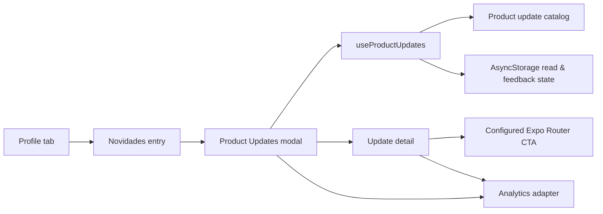

# Design — Product Updates

> Kiro feature spec.

## Context

GASP is an Expo Router React Native application. The Profile tab lives in `gasp/app/(tabs)/profile.tsx`; modal routes are registered automatically under `gasp/app/(modals)/`. Existing UI patterns include the shared `Text`, `IconButton`, `Card`, and `UnreadDot` components, a dark color system, Lucide icons, and modal transitions defined by `gasp/app/(modals)/_layout.tsx`.

This MVP uses version-controlled local content and device-local read/feedback state. It deliberately has no API or CMS dependency. A later backend/CMS integration can replace the content repository without changing the UI contract.

## Architecture



### Module boundaries

| Layer | New module | Responsibility |
| --- | --- | --- |
| Content | `gasp/constants/productUpdates.ts` | Typed, localized update catalog and static media/CTA metadata. |
| Domain | `gasp/services/api/schemas/productUpdate.schema.ts` | Zod schemas and inferred types for updates, statuses, localized content and local user state. |
| Persistence | `gasp/services/productUpdatesStorage.ts` | Reads/writes per-user local state using AsyncStorage and a versioned key. |
| Data hook | `gasp/hooks/useProductUpdates.ts` | Merges catalog with local state; exposes ordered sections, unread count, mark-read and feedback operations. |
| Analytics | `gasp/services/productUpdatesAnalytics.ts` | Centralizes the four event names and payload shapes. It is a no-op adapter until a project analytics provider is configured. |
| UI | `gasp/components/product-updates/*` | Reusable entry, list card, detail, and feedback components. |
| Route | `gasp/app/(modals)/product-updates.tsx` | Modal composition, navigation and loading/error presentation. |

## Data model

```ts
export const ProductUpdateSchema = z.object({
  id: z.string().min(1),
  status: z.enum(['released', 'improved', 'in_progress', 'coming_soon']),
  publishedAt: z.string().datetime(),
  content: z.object({
    'pt-BR': ProductUpdateContentSchema,
    en: ProductUpdateContentSchema,
  }),
  media: z.object({ type: z.enum(['image', 'video']), uri: z.string().url() }).optional(),
  actionRoute: z.string().startsWith('/').optional(),
});

export type ProductUpdate = z.infer<typeof ProductUpdateSchema>;
```

`publishedAt` is required even for `in_progress` and `coming_soon`, so these entries can be ordered and content changes can be published. It is not shown as a delivery commitment for future-facing statuses.

## Local persistence

Store state under a key scoped to the authenticated account, for example:

```text
gasp:product-updates:v1:<userId>
```

The storage service must validate parsed JSON with Zod and return an empty safe state on missing, malformed, or incompatible data. Failed persistence must not prevent viewing update content. The hook updates in-memory state optimistically, then persists it.

On logout, no explicit cleanup is necessary because state is isolated by user ID. The version segment permits a future breaking migration.

## Navigation and presentation

### Entry point

Add a `Novidades` action to the Profile screen below the current profile summary, using the `Sparkles` icon and `UnreadDot` when `unreadCount > 0`. Selecting it pushes `/(modals)/product-updates`.

This avoids adding a permanent tab and respects the current app structure, where profile-related secondary actions originate from Profile or Settings.

### Modal

`product-updates.tsx` uses the shared modal stack’s `slide_from_bottom` presentation. It has:

- A close/back `IconButton` with an accessible label.
- Heading `Novidades` and the localized subtitle.
- A `SectionList` grouped by publication month.
- A full-screen detail state within the same modal route; back returns to the list without dismissing the modal.
- The existing `QueryState` pattern only if the catalog becomes asynchronous; local content does not require a loading skeleton in MVP.

### Card and detail behavior

- Cards show category label, title, two-line summary, date for released/improved entries, arrow, and textual `Novo` label.
- Available statuses (`released`, `improved`) sort before future-facing statuses. Within each group, sort newest first.
- Future-facing items are visually separated by `O que estamos preparando`; they do not use dates in the visible UI.
- Selecting a card immediately calls `markRead(id)`, then opens its detail and emits the `viewed` event.
- The detail renders optional image/video, highlights, a CTA only if both `actionRoute` and localized `actionLabel` exist, and the two-choice feedback prompt.

## Content governance

For initial content, each catalog item must contain both `pt-BR` and `en` translations. The authoring checklist is:

1. Confirm the feature is live before using `released` or `improved`.
2. Describe a user benefit first, then up to three concrete highlights.
3. Include a CTA only when the configured route has been tested in the app.
4. Do not state future delivery dates without explicit public approval.
5. Keep no more than five unread-style featured updates in the catalog at one time.

## Analytics adapter

The app has no configured generic analytics provider. `productUpdatesAnalytics.ts` therefore defines a typed `trackProductUpdateEvent` boundary. The MVP implementation may log only in development; production transport can be added behind the same function later. UI components must not call a vendor SDK directly.

```ts
type ProductUpdatesEvent =
  | { name: 'product_updates_opened'; source: 'profile'; unread_count: number }
  | { name: 'product_update_viewed'; update_id: string; status: ProductUpdateStatus; position: number }
  | { name: 'product_update_cta_tapped'; update_id: string; cta_label: string }
  | { name: 'product_update_feedback_submitted'; update_id: string; helpful: boolean };
```

## Error handling

| Condition | User-facing behavior |
| --- | --- |
| Missing or malformed local state | Show catalog normally and treat all items as unread. |
| AsyncStorage write failure | Keep the current session state, allow reading and feedback, and report a non-fatal development warning. |
| Invalid update CTA route | Omit the CTA in production content validation; do not render a broken action. |
| Missing translation | Fall back to English; report a development warning so the catalog is fixed before release. |
| Empty catalog | Show the defined empty state. |

## Testing strategy

- Unit test catalog sorting, future-item separation, unread cap, locale fallback, and content validation.
- Unit test storage parsing, user key scoping, mark-read and feedback replacement.
- Component test Profile’s Novidades entry and unread-state semantics.
- Component test the list, details, CTA behavior, read marking, feedback state and empty state.
- Mock AsyncStorage and the analytics adapter in Jest.
- Manually verify VoiceOver/TalkBack labels, touch target sizing, modal dismissal, dark-theme contrast, Portuguese and English copy, and navigation for every configured CTA.

## Deferred decisions

- Remote CMS/API delivery and server-synced read state.
- Push or in-app announcement triggering when a new update is published.
- Images/video hosting and upload workflow.
- Aggregate analytics destination and product dashboard.
